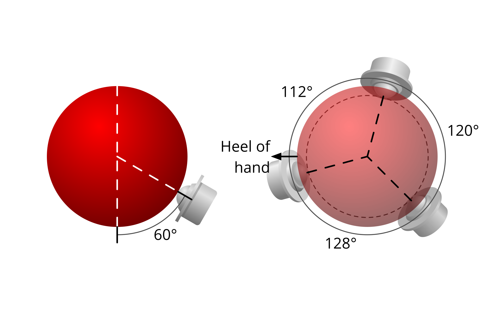

- [[Ptechinos/Brainstorming]] #Trackball
	- Mod pour #Ploopy classic
	- Explications sur les différents systèmes de bearings
	- Roller bearings
		- Agencement
			- {:height 180, :width 304}
			- Vertical
				- Celui proche du poignet à 77°
				- Les deux autres à 60°
			- Horizontal
				- ~= 120° entre chaque
	- Static
		- Trop de frictions une fois dans la souris
		- Réduire la fruction
			- Prendre une balle plus légère
			- Polir la balle
	- BTU
		- ![Agencement]
		-  {:height 200, :width 304}
		- Vertical
			- 60°
		- Horizontal
			- ~= 120 entre chaque
	- https://www.gbryant.co.uk/posts/2021-02-15_ploopy-trackball/post.html
- [[Ptechinos/Brainstorming]] #Trackball
	- Comparatif des 3 systèmes de bearings
	- [Reddit](https://www.reddit.com/r/ErgoMechKeyboards/comments/yyu4ra/trackball_bearings_a_comparison_of_cheap_rollers/)