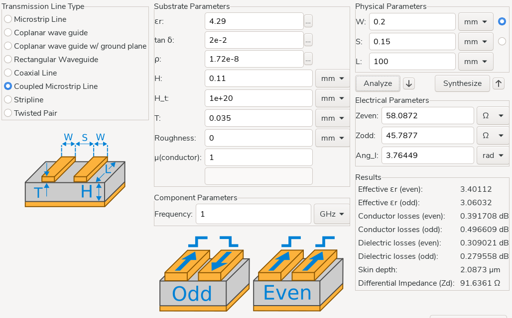

- Comment dimensionner les pairs différentielles pour l'USB (D+, D-)
  type:: [[Article]]
  author:: #[[ShawnHymel]]
  tags:: PCB, Impedance
  link:: [Officiel](https://www.digikey.fr/en/maker/projects/how-to-route-differential-pairs-in-kicad-for-usb/45b99011f5d34879ae1831dce1f13e93)
	- Description de l'outil de calcul présent dans #Kicad pour calculer l'impédance
	- Une pair différentielle USB D+/D- nécessite
		- Une impédance spécifique
			- 90Ω de différentiel
			- 45Ω sur chaque ligne
			- Marge de 15%
		- Un écart maximal de 3.81mm entre les deux lignes
		- Le référentiel de la terre doit être ininterrompue
		- Éviter les vias et des angles de 90°
		- Conserver une symétrie entre les différentes traces
	- {:height 256, :width 513}
- Why I rewrote my Rust keyboard firmware in Zig: consistency, mastery, and fun
  type:: [[Article]]
  author:: #KevinLynagh
  tags:: Zig, Firmware, Rust, Clavier
  link:: [Officiel](https://kevinlynagh.com/rust-zig/)
	- Explications sur les raisons du passage à #Zig pour le firmware
- Notes from a year of building keyboards
  type:: [[Article]]
  author:: #KevinLynagh
  tags:: Kicad, Clavier, PCB, Firmware, Rust, Bluetooth
  link:: [Officiel](https://kevinlynagh.com/keyboards/)
	- Retrospective sur les différents projets de claviers bluetooth
	- Conseils pour Kicad (PCB et schéma)
		- Setup des logiciels
		- Bascule batterie / USB
	- Ressources sur la programmation embarquée #Collection
