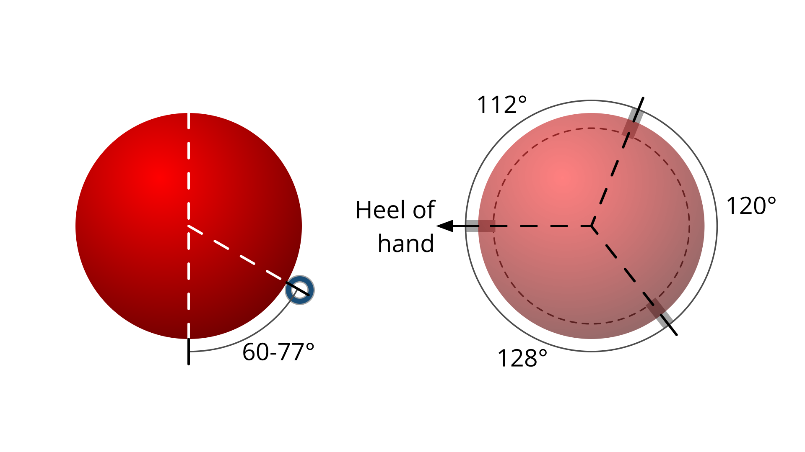
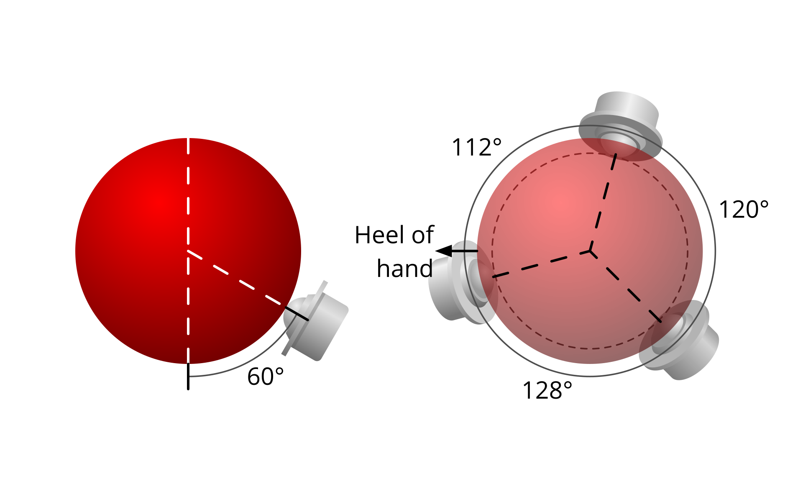

type:: [[Article]]
author:: #[[George Bryant]]
tags:: Ploopy, Trackball
link:: [Blog](https://www.gbryant.co.uk/posts/2021-02-15_ploopy-trackball/post.html)
[[Mar 25th, 2023]]

- ***
	- Études des différents types de bearings pour améliorer la trackball [[Ploopy/Classic]]
		- Original --> ((762fa0d6-cb08-482f-8b41-26bebf932d17))
		- Mod --> ((78878d11-65fc-475e-b5be-cfa454f309cd))
- ***
- # Facteurs d'évaluations utilisés
	- Régularité (*smoothness*)
	  id:: 641ffa6e-f162-4fbd-a1f2-13f7cbec1446
		- Caractérise la continuité de la résistance pour toutes directions et vitesses
		- Une forte régularité donne un mouvement consistant sans irrégularité
			- Pas de sauts dans le suivi
			- Pas de sensation de sable coincé
	- Résistance à la mise en mouvement (*static friction*)
	  id:: 641ffab4-0d51-45cb-8610-d3d6fa2f93ff
		- Caractérise la résistance sur des micros mouvements
			- Impacte la capacité à positionner précisément le curseur
		- Une résistance importante demande plus de force pour commencer à faire bouger la boule
	- Résistance aux frottements (*rolling friction*)
	  id:: 641ffb4b-e14b-4040-8119-663e99f67c73
		- Résistance au mouvement lorsque la balle est déjà en rotation
			- Impacte la capacité à faire naviguer rapidement le curseur sur de longues distances
		- Une résistance importante entraîne une mise à l'arrêt rapide du mouvement de la boule
- ## Réduire la résistance aux frottements
	- La résistance est proportionelle à la masse et à la rugosité de la surface
		- Prendre une boule plus légère
		- Polir la boule
- # Types de bearings
- ## Roller bearings
  id:: 762fa0d6-cb08-482f-8b41-26bebf932d17
	- Utilise des
	- Positionnement
		- {:height 180, :width 304}
		- Vertical
			- Base --> 60°
			- Surhaussement de celui au niveau du poignet pour la stabilité --> 77°
	- Évaluation
		- ((641ffa6e-f162-4fbd-a1f2-13f7cbec1446))
			- Bien
		- ((641ffab4-0d51-45cb-8610-d3d6fa2f93ff))
			- Normal
		- ((641ffb4b-e14b-4040-8119-663e99f67c73))
			- Normal
- ## Static
	- Utilise
	- Évaluation
		- ((641ffa6e-f162-4fbd-a1f2-13f7cbec1446))
			- Bien
		- ((641ffab4-0d51-45cb-8610-d3d6fa2f93ff))
			- Normal
		- ((641ffb4b-e14b-4040-8119-663e99f67c73))
			- Normal
- ## BTU
  id:: 78878d11-65fc-475e-b5be-cfa454f309cd
	- Positionnement
		- {:height 200, :width 304}
		- Vertical
			- Base --> 60°
		- Inclinaison légère des BTUs