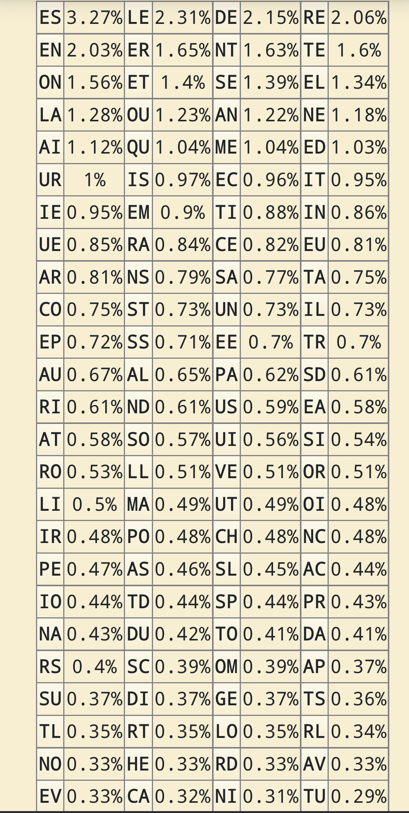
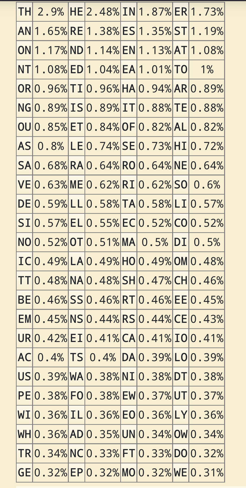

tags:: Layout
alias:: Bigram, Bigrams, Bigrammes
[[Feb 9th, 2024]]
***

- # Fréquences
	- | Français        | Anglais |
	  |[Source](https://www.dcode.fr/bigrammes) |  [Source](https://www.dcode.fr/bigrams)|
	  |:--------------:|:-----:|
	  | {:height 358, :width 217}|  {:height 358, :width 217}|
- ## Voir aussi
	- [[Trigramme]]
	-