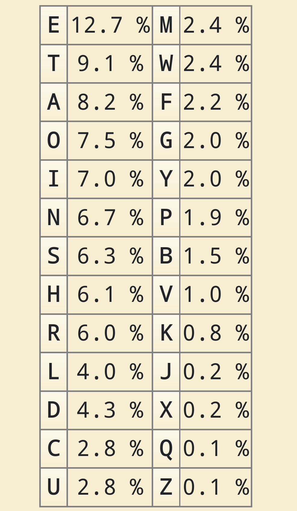
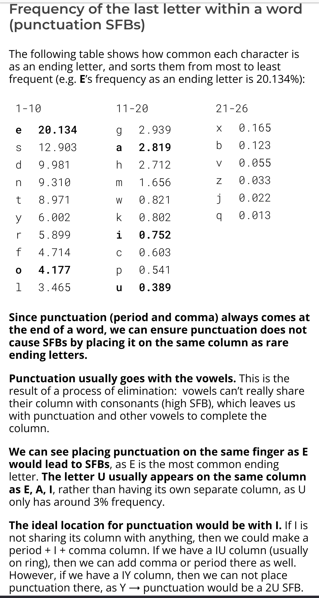

alias:: Clavier/Layouts, Clavier/Layout, Layouts
[[Oct 22nd, 2023]]
***

- ## References
	- [Keyboard  layouts doc](https://docs.google.com/document/d/1_a5Nzbkwyk1o0bvTctZrtgsee9jSP-6I0q3A0_9Mzm0)
	- [dcode](https://www.dcode.fr/bigrammes)
- ## Règles de construction
	- Répartition équitable
		- Favorise une bonne répartition des efforts
			- Utilisation
			- Mouvement
		- Penser aux touches spéciales
			- Symboles et touche espace
			- Raccourcis souvent utilisés
			- Fréquence différente suivant les langages
				- Ex: `Q` (fr) et `W` (eng)
	- Ponctuactions courantes
		- Éviter d'avoir `,` et `.` sur la même colonne qu'une lettre souvent utilisée en fin de mot
			- Très utilisé en programmation
				- Vrai aussi pour `<>` (shift) en #Programmation/Cpp
			- Plus de consonnes que de voyelles en fin de mot avec quelques exceptions
				- Français: `e`
					- TODO À compléter
				- Anglais : `e` `o`
			- Solutions
				- Ne pas mettre de ponctuation sous le `e` et le `o`
				- Placer `,` et `.` du coté des voyelles et sur une colonne de la home row
				- Prévoir une touche shift sur la main opposée pour `<>`
		- Éviter que  `'` devienne une redirection avec  les consonnes
			- Français : `l`, `n`, `d` `m`, `q`
			- TODO Anglais : `l`, `s`
			- Solutions
				- Placer `'` sur la main opposée à ces consonnes dans la limite du possible
				- Favoriser un roll `consonne + '`
		- `_` est très utilisé en particulier en programmation
			- Au milieu d'un mot la plupart du temps
			- Rarement en début et fin de mot
			- Solutions
				- `_` devrait être sur une colonne de la home row du même coté que la touche espace
				- Sur la home row opposée à la touche activant la couche des symboles
		- `:` et `;`
			- Courant en programmation
			- Courant en prise de note
				- `:` puis une liste
			- Solutions
				- Sur une colonne de la home row du même coté que la touche espace pour    favoriser un roll
				- Sur la home row opposée à la touche activant la couche des symboles
	- Réduire les SFBs
		- SFB < 1.5% == parfait
			- Avec prise en compte des ponctuations
		- Exemple des voyelles
			- Français : `ou` `eu`  `ue` `au` `ea`
			- Anglais : `ea` `ou` `ei`
			- Solutions possibles
				- `eo` `iu` `a` (pinky)
				- `eo` `au` `i` (pinky)
				- `iu` `eo` `a` (ring)
				- `e` `ao` `iu` (ring)
	- Favoriser les doigts forts pour les lettres ayant une fréquence importante
	  id:: 65c7aa82-b5f9-4479-ae87-803b8701e59a
		- | Français        | Anglais |
		  |:--------------:|:-----:|
		  | {:height 300, :width 188}|  {:height 300, :width 188}|
		- Voyelles
			- Français : `e`, `a`, `i`, `u`, `o`, `y`
				- `y` a une très faible fréquence
				- `u` et `o` ont des fréquences similaires
			- Anglais : `e`, `a`, `o`, `i`, `u`, `y`
				- `y` et `u` ont une faible fréquence
				- `u` et o` ont des fréquences similaires
			- Solutions
				- Placer `e` et `a` sur les doigts les plus forts
				- `y` n'est pas du tout prioritaire
				- Favoriser
		- Consonnes
			- TODO Français :
			- TODO Anglais :
			- Solutions
				- Priorité au `Q` par rapport au `W`
		- Limiter le mouvement du petit doigt en particulier vers le haut
		  id:: 65c7bf1d-3745-4acb-ba68-74ddf0730648
			- Utiliser la touche du haut seulement si possible de profiter du alt-figuring
			- Solutions
				- Favoriser le bigramme `QU` en plaçant le `Q` sur le petit doigt de la main avec les voyelles
					- Placement faisant un compromis entre Français et Anglais
	- Utiliser un cluster pour les voyelles
	  id:: 65c656e5-f37c-4cca-bd36-23abc7bcfb72
		- ((65c7aa82-b5f9-4479-ae87-803b8701e59a))
		- Combiner avec une consonne  ayant **une haute fréquence** et qui **roll principalement dans un sens**
			- `H`
				- Français : Consonne + Voyelle presque majoritairement
					- **Lettre très peu utilisée en français**
				- Anglais : Consonne + Voyelle presque exclusivement
				- Favorise des rolls vers l'extérieur
				- Solutions :
					- Placer cette lettre sur la main  avec le cluster de voyelles pour **favoriser** les rolls et réduire les redirections
					- **Ne pas placer** cette lettre sur la home row car peu utilisée en français
			- `N`
				- Français : Voyelle + Consonne **très** majoritairement
				  id:: 65c79a3d-9daa-46dc-8545-bfe7994b738c
					- Bigrammes : 75.31%
					- Trigrammes : 81.28%
					- Redirections : `INE`
					- **Lettre très utilisée en français**
				- Anglais : Voyelle + Consonne majoritairement
				- Favorise des rolls vers l'intérieur
				- Solutions :
					- Placer cette lettre sur la main  avec le cluster de voyelles pour **favoriser** les rolls et réduire les redirections
					- Placer cette lettre sur la home row car très utilisée
			- `S`
				- Français : Voyelles + Consonne
				- Anglais : Voyelles + Consonne
				- Solutions :
					- Placer cette lettre sur la main opposée au cluster de voyelles pour **réduire** les redirections
			- `L`, `R`
				- Français : Ne favorise pas de sens
				- Anglais : Ne favorise pas de sens
				- Solutions :
					- Placer ces lettres sur la main opposée au cluster de voyelles pour **réduire** les redirections
			- `T`
				- Français : Ne favorise pas de sens
				- Anglais : Consonne + Consonne
				- Solutions :
					- Placer ces lettres sur la main opposée au cluster de voyelles pour **favoriser** les rolls
	- Choisir un groupe de consonnes ayant peu de redirections
	  id:: 65c79601-53fa-4533-b21a-b960e77509fc
		- Main voyelles + `FNH`
			- Main consonnes ayant le roll intérieur `ST`
				- CRST
				- STRD
				- SRTD
				- SRTC
			- + Réduit fortement les scissors
			- - Main droite a plus de travail
			- Layouts existants
				- Canary, Sturdy, Snug, Gemini, Rolly
		- Main voyelles + `FMH`
			- Considérer comme expérimental
			- Main consonnes
				- NRTS
				- RNTS
				- STND
			- + Meilleur roll / redirection ratio
			- - Index gauche travaille beaucoup
				- SC, SY, SW, SG
			- `L` sur la home row possible coté voyelles
				- Augmente fortement les rolls en français
					- `LE`
					- `EL`
			- Bon placement du `D` et `K`
				- Très utilisé dans [[SublimeText]]
			- Layouts existants
				- Fire, Flamme, Flare
		- Main voyelles + `GMC`
			- Layouts existants
				- [Stronk](https://oxey.dev/stronk/index.html)
		- Main voyelles + `FCG`
			- Layouts existants
				- [Dhorf](https://oxey.dev/dhorf/index.html)
		- Main voyelles + `WYC`
			- Layouts existants
				- Whorf
		- Main voyelles + `JHL`
			- Layouts existants
				- [Recurva](https://github.com/GalileoBlues/Recurva)
		- Tenir compte des symboles / lettres sur les autres couches
			- `é`, `_`, `'`
			- `è`, `:`, `;`
		- ((65c654fe-c255-4723-9d4c-5b779128e616))
	- Réduire les redirections
		- ((65c656e5-f37c-4cca-bd36-23abc7bcfb72))
		- ((65c79601-53fa-4533-b21a-b960e77509fc))
	- Favoriser les **rolls**
		- ((65c656e5-f37c-4cca-bd36-23abc7bcfb72))
			- Mettre des consonnes favorisant les voyelles sur la même main augmente les rolls
				- `R`, `L`, `N`
			- Mettre des consonnes favorisant les consonnes sur la même main augmente les alternations
				- `H`, `T`
			- `S` n'a pas de préférences et ne change donc pas le rapport roll/alternation
		- Placer `Y` (semi-voyelle) sur la main opposée
		- ((65c654fe-c255-4723-9d4c-5b779128e616))
		- Donne une sensation de fluidité
		- Alterner souvent les mains demande plus de coordinations
		- Rolls vers l'intérieurs moins fatiguants / plus naturels
	- Touche espace sur le pouce
	  id:: 65c654fe-c255-4723-9d4c-5b779128e616
		- Statistiques
			- Voir [[a200]]
			- 18.5% des inputs (eng)
			- 55% des [[Trigrammes]] (eng)
			- {:height 1024, :width 271}
		- Sur la main opposée au cluster pour les voyelles
		- Attention à éviter les redirections avec les [[Bigrammes]] de consonnes
			- ` th` (roll in) et espace sur la main gauche
			- ` an` (roll in) et espace sur la main droite
			- Solutions
				- Inverser le sens du roll
				- Basculer la touche espace sur l'autre main
-
-
-