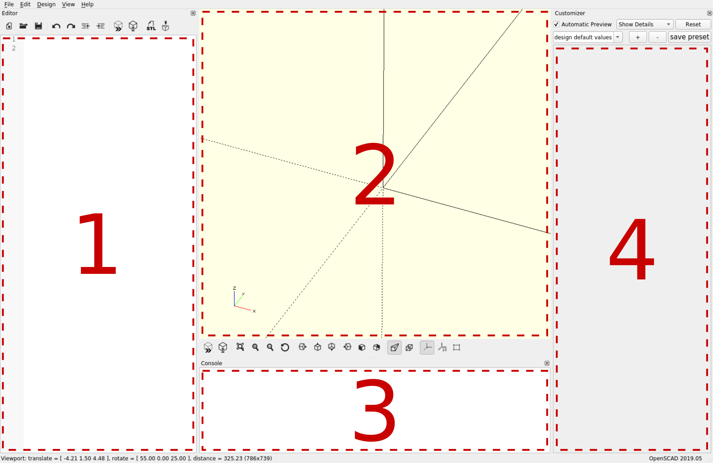

type:: [[Book]]
author:: #[[Jochen Kerdels]]
tags:: #OpenScad #CAD #Formation 
link:: https://mastering-openscad.eu/buch/introduction/
[[Mar 3rd, 2023]]

- # Introduction
- Disponible en version papier sur [Amazon](https://www.amazon.com/dp/3753458589)
- Apprentissage à travers 10 projets de plus en plus complexe
- # Généralités
	- link:: https://mastering-openscad.eu/buch/gui-overview/
	- {:height 400, :width 607}
		- 1 --> Zone de code
		- 2 --> Aperçu et rendu 3d
			- **Preview** pour voir un aperçu rapide
			- **Render** pour générer un rendu final exportable
		- 3 --> Console a
			- Affichage des erreurs et autre informations
		- 4 --> Customiseur
		  id:: 6403cc3b-218b-47f7-b134-6c176204c6f3
			- (Avancé) Customisation / UI en lien avec certaines variables du code
- # Options basiques
	- link:: https://mastering-openscad.eu/buch/basic_ops_and_structure/
	- Le langage utilisé est **descriptif**
		- Ce n'est **pas** un langage de [[Programmation]]
		- Décrit la géométrie à partir de primitives et instructions simples
	- L'ordre de déclaration des variables n'a pas d'importance
	  id:: 6403cc3b-fa6f-4eb4-9934-b87e25ee3a0d
		- ```openscad
		  radius_with_a_name = 10;
		  sphere( r = radius_with_a_name );
		  radius_with_a_name = 20;
		  ```
			- Il existe une variable `radius_with_a_name` ayant pour valeur 20
				- Seule la dernière valeur est conservée
	- Possible d'utiliser des **fonctions** pour éviter les répétitions
		- ```openscad
		  adjustment = 0.7;
		  adjustment_factor = 1.05;
		  
		  function adjust(x) = (x + adjustment) * adjustment_factor;
		  
		  main_radius = adjust(10);
		  margin = adjust( 5);
		  depth = adjust(25);
		  ```
	- ## Transformations
	- Sytème de coordonnées
		- X = Positif vers l'avant
		- Y = Positif vers la droite
		- Z = Positif vers le haut
		- [[draws/2023-03-03-21-08-29.excalidraw]]
	- Les transformations se font par rapport à l'origine
		- ```openscad
		  rotate( [0,0,45] ) translate( [20,0,0] ) cube(10,true);
		  ```
		- Possible de cumuler des opérations afin de former une nouvelle géométrie
			- L'ordre des transformations est important
	- ## Combiner les géométries
	- Combiner des formes géométriques --> opérations booléenes
		- Exemple : `difference`
		- #+BEGIN_CAUTION
		  Il est parfois nécessaire de faire légèrement dépasser la forme lors d'une soustraction par exemple pour tenir compte des erreurs d'arrondies
		  #+END_CAUTION
			- ```openscad
			  // Dimensions in mm [width, depth, height]
			  plate = [100,50,5];
			  
			  hole_dm     = 6;
			  hole_margin = 4;
			  
			  difference() {
			  	// Reference geometry
			  	cube( plate );
			      
			      // Others are substract to the first geometry
			  	translate
			  	([
			  		hole_margin + hole_dm / 2,
			  		hole_margin + hole_dm / 2,
			  		-1
			  	])
			  	
			      // Add on both side a little margin 
			      // Here 1 on each side on the Z axis
			      color( "red" )
			  	cylinder( d = hole_dm, h = plate.z + 2);
			  }
			  ```
	- Affichage d'une géométrie intermédiaire en **transparence** --> `#`
		- Validation / Debug de la position des formes à combiner
		- ```openscad
		  #cylinder( d = hole_dm, h = plate.z + 1);
		  ```
	- Boucles --> `for`
		- Permet de construire plusieurs géométries tout en évitant les répétitions
		- Possible de parcourir des tableaux / vecteurs ou bien des *range loop*
		- ```openscad
		  // Dimensions in mm [width, depth, height]
		  plate = [100,50,5];
		  
		  hole_dm     = 6;
		  hole_margin = 4;
		  
		  difference() {
		  	cube( plate );
		  
		  	// Holes
		      abs_margin = hole_margin + hole_dm / 2;
		      // Use range loop to generate x positions
		  	x_hole_dist = plate.x - 2 * abs_margin;
		  	x_values    = [abs_margin : x_hole_dist : plate.x - abs_margin];
		      // Use a simple array to store y positions
		  	y_values   = [abs_margin, plate.y - abs_margin];
		  	
		      // Loop end is marked with ; symbol
		  	for (x = x_values, y = y_values)
		      translate( [x, y, -1] )
		      color( "red" )
		      cylinder( d = hole_dm, h = plate.z + 2);
		  }
		  ```
	- Paramétrisation --> ((6403cc3b-218b-47f7-b134-6c176204c6f3))
		- Permet d'accéder directement dans l'interface aux différentes variables globales
			- Possible de faire des tests/variations sans changer le code
			- Possible de visualiser les différentes valeurs de manière plus lisible
			- Les commentaires sont utilisés comme légende dans l'interface
	- Fonctions --> `module`
		- Permet d'éviter la répétition en écrivant un code **générique réutilisable**
			- Le type des paramètres est automatiquement / dynamiquement déterminé
			- Possible d'avoir des valeurs pré-définies
		- ```openscad
		  module hole_plate( size, hole_dm, hole_margin, hole_count = [2,2] ) {
		  	difference() {
		  		cube(size);
		  
		  		abs_margin  = hole_margin + hole_dm/2;
		  		x_hole_dist = (size.x - 2*abs_margin) / (hole_count.x - 1);
		  		y_hole_dist = (size.y - 2*abs_margin) / (hole_count.y - 1);
		  		x_values    = [abs_margin : x_hole_dist : size.x - abs_margin + 0.1];
		  		y_values    = [abs_margin : y_hole_dist : size.y - abs_margin + 0.1];
		  
		  		for (x = x_values, y = y_values)
		  	    translate( [x, y, -1] )
		  	    color( "red" )
		  	    cylinder( d = hole_dm, h = size.z + 2);
		  	}
		  }
		  
		  // Use our module to create two plates
		  hole_plate([100,50,5], 6, 4);
		  translate([0,60,0])
		  hole_plate(size = [50,50,5], hole_dm = 3, hole_margin = 2, hole_count=[5, 5]);
		  ```
	- Conditions
		- Opérateur ternaire
			- ```openscad
			  result = test : first ? second;
			  ```
		- `if`
			- Permet de déterminer deux chemins possible en fonction d'une condition
				- ```openscad
				  if (test) {	
				  	cube();
				  }
				  else {
				  	square();
				  }
				  ```
			- ((6403cc3b-fa6f-4eb4-9934-b87e25ee3a0d))
				- Une variable ne peut être initialisée qu'une seule fois donc le code suivant ne donnera pas toujours le comportement attendu
					- ```openscad
					  // x_hole_dist 
					  x_hole_dist = 0;
					  if (hole_count.x > 1) {
					  	x_hole_dist = (size.x - 2 * abs_margin) / (hole_count.x - 1);
					  }
					  ```