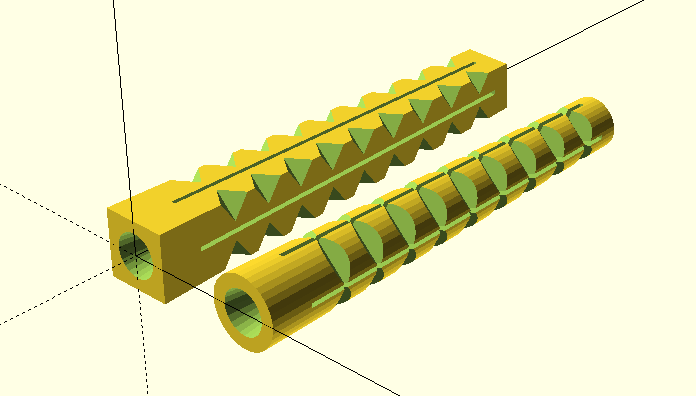

type:: [[Book]]
auteur:: #[[Jochen Kerdels]]
tags:: #OpenScad #CAD #Formation 
link:: https://mastering-openscad.eu/buch/introduction/
[[Mar 3rd, 2023]]

- # Introduction
	- Disponible en version papier sur [Amazon](https://www.amazon.com/dp/3753458589)
	- Apprentissage à travers 10 projets de plus en plus complexe
- # Généralités
	- type:: Article
	  link:: https://mastering-openscad.eu/buch/gui-overview/
	- {:height 400, :width 607}
		- 1 --> Zone de code
		- 2 --> Aperçu et rendu 3d
			- **Preview** pour voir un aperçu rapide
			- **Render** pour générer un rendu final exportable
		- 3 --> Console a
			- Affichage des erreurs et autre informations
		- 4 --> Customiseur
		  id:: 6403cc3b-218b-47f7-b134-6c176204c6f3
			- (Avancé) Customisation / UI en lien avec certaines variables du code
- # Options basiques
	- type:: Article
	  link:: https://mastering-openscad.eu/buch/basic_ops_and_structure/
	- Le langage utilisé est **descriptif**
		- Ce n'est **pas** un langage de [[Programmation]]
		- Décrit la géométrie à partir de primitives et instructions simples
	- L'ordre de déclaration des variables n'a pas d'importance
	  id:: 6403cc3b-fa6f-4eb4-9934-b87e25ee3a0d
		- ```openscad
		  radius_with_a_name = 10;
		  sphere( r = radius_with_a_name );
		  radius_with_a_name = 20;
		  ```
			- Il existe une variable `radius_with_a_name` ayant pour valeur 20
				- Seule la dernière valeur est conservée
	- Possible d'utiliser des **fonctions** pour éviter les répétitions
		- ```openscad
		  adjustment = 0.7;
		  adjustment_factor = 1.05;
		  
		  function adjust(x) = (x + adjustment) * adjustment_factor;
		  
		  main_radius = adjust(10);
		  margin = adjust( 5);
		  depth = adjust(25);
		  ```
	- ## Transformations
	- Sytème de coordonnées
		- X = Positif vers l'avant
		- Y = Positif vers la droite
		- Z = Positif vers le haut
	- Les transformations se font par rapport à l'origine
		- ```openscad
		  rotate( [0,0,45] ) translate( [20,0,0] ) cube(10,true);
		  ```
		- Possible de cumuler des opérations afin de former une nouvelle géométrie
			- L'ordre des transformations est important
	- ## Combiner les géométries
	- Couleur des formes --> `color( "name" )`
	- Opérations booléenes --> `difference()` `union()` `intersection()` `...`
		- #+BEGIN_CAUTION
		  Il est parfois nécessaire de faire légèrement dépasser la forme lors d'une `difference` par exemple pour tenir compte des erreurs d'arrondies
		  #+END_CAUTION
			- ```openscad
			  // Dimensions in mm [width, depth, height]
			  plate = [100,50,5];
			  
			  hole_dm     = 6;
			  hole_margin = 4;
			  
			  difference() {
			  	// Reference geometry
			  	cube( plate );
			      
			      // Others are substract to the first geometry
			  	translate
			  	([
			  		hole_margin + hole_dm / 2,
			  		hole_margin + hole_dm / 2,
			  		-1
			  	])
			  	
			      // Add on both side a little margin 
			      // Here 1 on each side on the Z axis
			      color( "red" )
			  	cylinder( d = hole_dm, h = plate.z + 2);
			  }
			  ```
	- Affichage d'une géométrie intermédiaire en **transparence** --> `#`
		- Validation / Debug de la position des formes à combiner
		- ```openscad
		  #cylinder( d = hole_dm, h = plate.z + 1);
		  ```
	- Boucles --> `for`
		- Permet de construire plusieurs géométries tout en évitant les répétitions
		- Possible de parcourir des tableaux / vecteurs ou bien des *range loop*
		- ```openscad
		  // Dimensions in mm [width, depth, height]
		  plate = [100,50,5];
		  
		  hole_dm     = 6;
		  hole_margin = 4;
		  
		  difference() {
		  	cube( plate );
		  
		  	// Holes
		      abs_margin = hole_margin + hole_dm / 2;
		      // Use range loop to generate x positions
		  	x_hole_dist = plate.x - 2 * abs_margin;
		  	x_values    = [abs_margin : x_hole_dist : plate.x - abs_margin];
		      // Use a simple array to store y positions
		  	y_values   = [abs_margin, plate.y - abs_margin];
		  	
		      // Loop end is marked with ; symbol
		  	for (x = x_values, y = y_values)
		      translate( [x, y, -1] )
		      color( "red" )
		      cylinder( d = hole_dm, h = plate.z + 2);
		  }
		  ```
	- Paramétrisation --> ((6403cc3b-218b-47f7-b134-6c176204c6f3))
		- Permet d'accéder directement dans l'interface aux différentes variables globales
			- Possible de faire des tests/variations sans changer le code
			- Possible de visualiser les différentes valeurs de manière plus lisible
			- Les commentaires sont utilisés comme légende dans l'interface
	- Fonctions --> `module`
	  id:: 64049d27-21da-4527-8ceb-4ddee4bd7232
		- Permet d'éviter la répétition en écrivant un code **générique réutilisable**
			- Le type des paramètres est automatiquement / dynamiquement déterminé
			- Possible d'avoir des valeurs pré-définies
		- ```openscad
		  module hole_plate( size, hole_dm, hole_margin, hole_count = [2,2] ) {
		  	difference() {
		  		cube(size);
		  
		  		abs_margin  = hole_margin + hole_dm/2;
		  		x_hole_dist = (size.x - 2*abs_margin) / (hole_count.x - 1);
		  		y_hole_dist = (size.y - 2*abs_margin) / (hole_count.y - 1);
		  		x_values    = [abs_margin : x_hole_dist : size.x - abs_margin + 0.1];
		  		y_values    = [abs_margin : y_hole_dist : size.y - abs_margin + 0.1];
		  
		  		for (x = x_values, y = y_values)
		  	    translate( [x, y, -1] )
		  	    color( "red" )
		  	    cylinder( d = hole_dm, h = size.z + 2);
		  	}
		  }
		  
		  // Use our module to create two plates
		  hole_plate([100,50,5], 6, 4);
		  translate([0,60,0])
		  hole_plate(size = [50,50,5], hole_dm = 3, hole_margin = 2, hole_count=[5, 5]);
		  ```
	- Conditions
		- Opérateur ternaire
			- ```openscad
			  result = test : first ? second;
			  ```
		- `if`
			- Permet de déterminer deux chemins possible en fonction d'une condition
				- ```openscad
				  if (test) {	
				  	cube();
				  }
				  else {
				  	square();
				  }
				  ```
			- ((6403cc3b-fa6f-4eb4-9934-b87e25ee3a0d))
				- Une variable ne peut être initialisée qu'une seule fois donc le code suivant ne donnera pas toujours le comportement attendu
					- ```openscad
					  // x_hole_dist 
					  x_hole_dist = 0;
					  if (hole_count.x > 1) {
					  	x_hole_dist = (size.x - 2 * abs_margin) / (hole_count.x - 1);
					  }
					  ```
	- Importer des fichiers externes
		- Le chemin du fichier doit être ...
			- ... relatif au fichier courant
			- ... relatif au dossier utilisé pour stocker les bibliothèques
				- Voir *File -> Show Library Folder*
		- Inclusion complète du code source -> `include <fichier.scad>;`
			- ((64049d27-21da-4527-8ceb-4ddee4bd7232))
			- Variables globales
			- Instructions
			- ...
		- Inclusion partielle du code source --> `use <fichier.scad>;`
			- ((64049d27-21da-4527-8ceb-4ddee4bd7232))
		- Autres formats --> `import("fichier.whatever");`
			- Formats 2D
				- DXF
				- SVG
			- Format 3D
				- STL
				- OFF
				- AMF
				- 3MF
- # Project 1: Shelf Bracket
	- type:: Article
	  link:: https://mastering-openscad.eu/buch/example_01/
	- [Code OpenScad ](file:///home/pampi/Documents/Course/MasteringOpenScad/shelf_bracket.scad)
	- {:height 322, :width 379}
	- ((64049d27-21da-4527-8ceb-4ddee4bd7232))
		- Possible d'avoir des fonctions imbriquées dans des fonctions
		- ```openscad
		  module shelf_bracket(side_a, side_b, width, thickness) {
		    module xhole_plate(size, h_dm, h_num, margin) {
		      difference() { cube(size); }
		    }
		  
		    // Side A
		    xhole_plate([ side_a[0], width, thickness ], side_a[1], side_a[2], thickness);
		    // Side B
		    xhole_plate([ side_b[0], width, thickness ], side_b[1], side_b[2], thickness);
		  }
		  ```
	- Variables spéciales --> `$var`
		- Contrôler le niveau de détail des **courbes** --> `$fn`
			- **Augmenter** la valeur **augmente** la précision
				- Une valeur supérieure à $$100$$ est rarement nécessaire
			- Utilisable pour une géométrie en particulier
				- ```openscad
				  cylinder(d, h, $fn=18);
				  ```
			- Utilisable globalement
				- ```openscad
				  $fn=111;
				  ```
		- Nombre d'éléments après une fonction --> `$children`
	- Accéder aux éléments après l'appel d'une fonction --> `children()`
		- Permet aux fonction de se comporter comme des transformations
		- ```openscad
		  /* ... */
		  module trans() {
		  	projection(cut = true)
		  	children(0);
		  }
		  
		  // Tranformation applied to result of gen
		  trans()
		  gen();
		  ```
	- Projection 3D --> `projection()`
		- Permet de projeter la géométrie sur le plan **XY**
			- Visible uniquement dans la sortie du **Render**
		- ```openscad
		  /* ... */
		  
		  module output(templates = false) {
		  	if (templates) {
		          // Side A
		  		projection(cut = true)
		  		children(0);		
		  		
		          // Side B
		  		translate( [-0.01, 0, 0] )
		  		projection(cut = true)
		  		rotate( [0, -90, 0] )
		  		children(0);		
		  	} else {
		  		children(0);
		  	}
		  }
		  
		  output(templates = false)
		  shelf_bracket(
		    side_a    = [50, 6, 1],
		    side_b    = [75, 4, 3],
		    width     = 35,
		    thickness = 4
		  );
		  ```
	- Astuces pour l'impression 3D
		- Optimiser l'orientation
			- Limiter l'utilisation de support durant l'impression
				- Réduit le gaspillage
				- Éviter le nettoyage post impression et un risque de cassure
			- Réduire les forces de cisaillement entre différentes couches
				- Permet d'améliorer la résistance de la pièce
- # Project 2: Wall Anchor
	- type:: Article
	  link:: https://mastering-openscad.eu/buch/example_02/
	- [Code OpenScad ](file:///home/pampi/Documents/Course/MasteringOpenScad/wall_anchor.scad)
	- {:height 269, :width 396}
	-
		-
- # What is missing ?
	- type:: Article
	  link:: https://mastering-openscad.eu/buch/wasfehlt/
	  [[Apr 9th, 2023]]
	- ## Debug Symbols
		- Forcer la transparence pour une géométrie -->`%`
		- Désactiver une géométrie --> `*`
		-