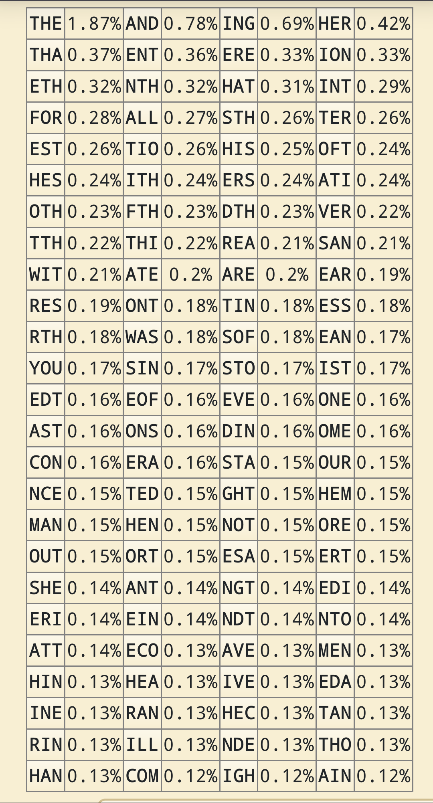
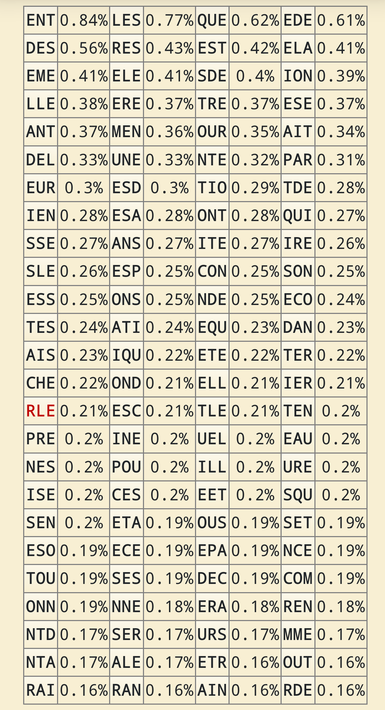

tags:: Clavier, Layout
alias:: Trigram, Trigrams, Trigrammes
[[Feb 9th, 2024]]
***

- # Fréquences
	- | Français        | Anglais |
	  |:--------------:|:-----:|
	  | {:height 300, :width 188}|  {:height 300, :width 188}|
	- [Français](https://www.dcode.fr/trigrammes)
		- 
	- [Anglais](https://www.dcode.fr/trigrams)
		- 
- ## Voir aussi
	- [[Bigramme]]